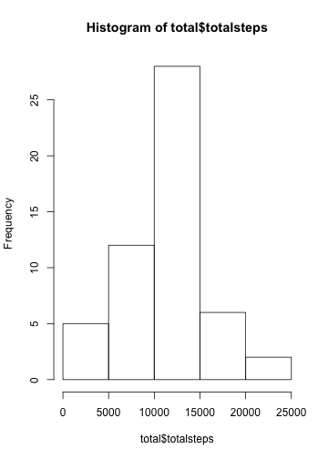

####Loading and processing the Data


```r
activity<-read.csv("activity.csv",na.string="NA")
```
<br>
<br>

---------------------------

####What is mean total number of steps taken per day?

#####1. Make a histogram of the total number of steps taken each day


```r
require('dplyr')
require('ggplot2')
```


```r
total<-activity %>% group_by (date) %>% summarise (totalsteps=sum(steps)) 
hist(total$totalsteps)
```

 

#####2. Calculate and report the mean and median total number of steps taken per day


```r
mean(total$totalsteps,na.rm=T)
```

```
## [1] 10766.19
```

```r
median(total$totalsteps,na.rm=T)
```

```
## [1] 10765
```

####<span style="color:blue">The average steps per day is 10766.19. the mean value of steps slightly different with median.</span>
<br>
<br>

---------------------------

####What is the average daily activity pattern?

#####1. Make a time series plot of the 5-minute interval (x-axis) and the average number of steps taken, averaged across all days (y-axis)

```r
dailysteps<-activity %>% group_by (interval) %>% summarise (steps=mean(steps,na.rm=T))
ggplot(dailysteps,aes(x=interval,y=steps))+geom_line()+xlab("daily time")+ylab("average steps")
```

 

#####2. Which 5-minute interval, on average across all the days in the dataset, contains the maximum number of steps?

```r
dailysteps[which.max(dailysteps$steps),]
```

```
## Source: local data frame [1 x 2]
## 
##   interval    steps
##      (int)    (dbl)
## 1      835 206.1698
```

####<span style="color:blue">Daily average steps of 5 min interval change dramatically. the highest peak is observed in the morning 8:00~9:00 AM.</span>

<br>
<br>

---------------------------

####Imputing missing values

#####1. Calculate and report the total number of missing values in the dataset (i.e. the total number of rows with NAs)

```r
nrow(activity[is.na(activity$steps),])
```

```
## [1] 2304
```

#####2. Devise a strategy for filling in all of the missing values in the dataset. Create a new dataset that is equal to the original dataset but with the missing data filled in.

```r
for (i in 1:nrow(activity)){
     if (is.na(activity$steps[i])){
          activity$steps[i]<-dailysteps$steps[which(activity$interval[i]==dailysteps$interval)]
     }
}
```


#####3. Make a histogram of the total number of steps taken each day and Calculate and report the mean and median total number of steps taken per day. 
Do these values differ from the estimates from the first part of the assignment? What is the impact of imputing missing data on the estimates of the total daily number of steps?

```r
imputed<-activity %>% group_by(date) %>% summarise (totalsteps=sum(steps))
hist(imputed$totalsteps)
```

 

```r
mean (imputed$totalsteps)
```

```
## [1] 10766.19
```

```r
median(imputed$totalsteps)
```

```
## [1] 10766.19
```

####<span style="color:blue"> The 2304 NA values of original data were replaced by the average steps of each interval. After imputing NA value, the histogram and mean values were not changed so much. </span>

<br>
<br>

---------------------------

####Are there differences in activity patterns between weekdays and weekends?

#####1. Make a panel plot containing a time series plot of the 5-minute interval (x-axis) and the average number of steps taken, averaged across all weekday days or weekend days (y-axis). 


```r
activity$weekday<-weekdays(as.POSIXlt(activity$date))
for (i in 1:nrow(activity)){
     if (activity$weekday[i]=="Sunday" | activity$weekday[i]=="Saturday"){activity$weekday[i]<-"weekend"}
     else {activity$weekday[i]<-"weekday"}
}
activity$weekday<-as.factor(activity$weekday)

weeksteps<-activity%>% group_by(weekday,interval)%>% summarise(steps=mean(steps))
ggplot(weeksteps,aes(x=interval,y=steps))+geom_line()+facet_wrap(~weekday,ncol=1)
```

 

####<span style="color:blue"> The changes of average steps of weekdays in time are differ from that of weekend. The higher steps in the morning(6:00~9:00 AM) of weekdays are significant. But overall sum of steps of weekend are higher than that of weekdays</span>


```r
sum(weeksteps[weeksteps$weekday=="weekday",]$steps)
```

```
## [1] 10255.85
```

```r
sum(weeksteps[weeksteps$weekday=="weekend",]$steps)
```

```
## [1] 12201.52
```


